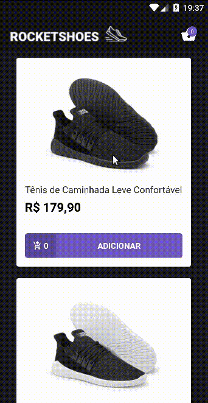

  
   

<h1 align="center">
RocketShoes Mobile
</h1>

  <a href="#tecnologias-utilizadas">Tecnologias utilizadas</a> |
  <a href="#como-usar">Como Usar</a> |
  <a href="#funcionalidades">Funcionalidades</a>

Esta aplicação foi desenvolvida durante o [Desafio 7](https://github.com/Rocketseat/bootcamp-gostack-desafio-07/blob/master/README.md) do Bootcamp da Rocketseat para fixação dos conceitos de Hooks e da arquitetura Flux.
Para tanto, criamos este app em React-native que chamamos de Rocketshoes, nele o usuário tem a opção de adicionar e remover produtos ao carrinho, simulando assim, uma das funcionalidades de uma loja virtual.

## Tecnologias utilizadas

- [axios](https://github.com/axios/axios)
- [numeral](http://numeraljs.com/)
- [immer](https://github.com/immerjs/immer)
- [prop-types](https://github.com/facebook/prop-types)
- [react](https://github.com/facebook/react)
- [react-native](https://github.com/facebook/react-native)
- [react-native-gesture-handler](https://github.com/kmagiera/react-native-gesture-handler)
- [react-native-vector-icons](https://github.com/oblador/react-native-vector-icons)
- [react-navigation](https://github.com/react-navigation/react-navigation)
- [react-redux](https://github.com/reduxjs/react-redux)
- [reactotron-react-native](https://github.com/infinitered/reactotron-react-native)
- [reactotron-redux](https://github.com/infinitered/reactotron-redux)
- [reactotron-redux-saga](https://github.com/infinitered/reactotron-redux-saga)
- [redux](https://github.com/reduxjs/redux)
- [redux-saga](https://github.com/redux-saga/redux-saga)
- [styled-components](https://github.com/styled-components/styled-components)

## Como usar

Pré-requisitos:

- Yarn/Npm
- Emulador configurado para o react-native

Tendo isso, rodamos o aplicativo

> react-native run-android

Ou, no emulador do iphone

> react-native run-ios

## Funcionalidades

- Adicionar/Remover produtos ao carrinho
- Alterar quantidade do produtos no carrinho
